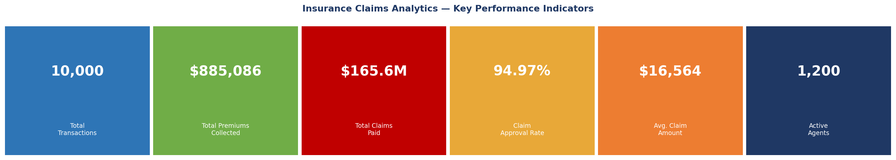
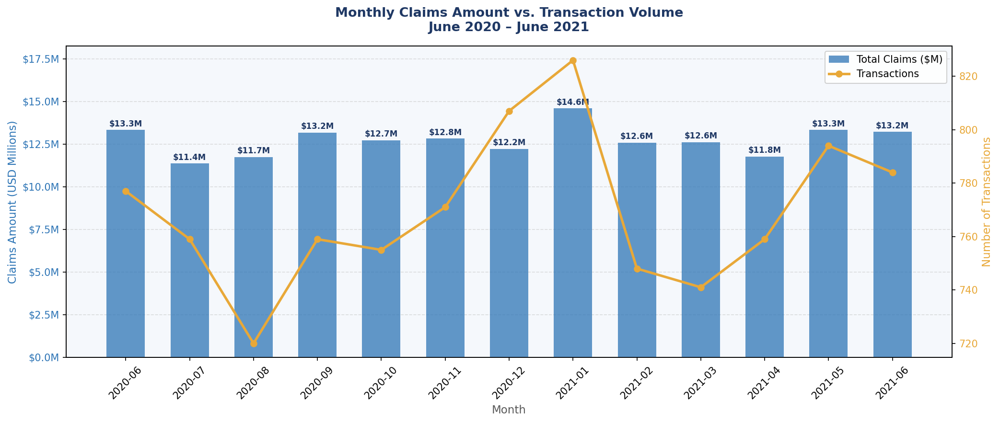
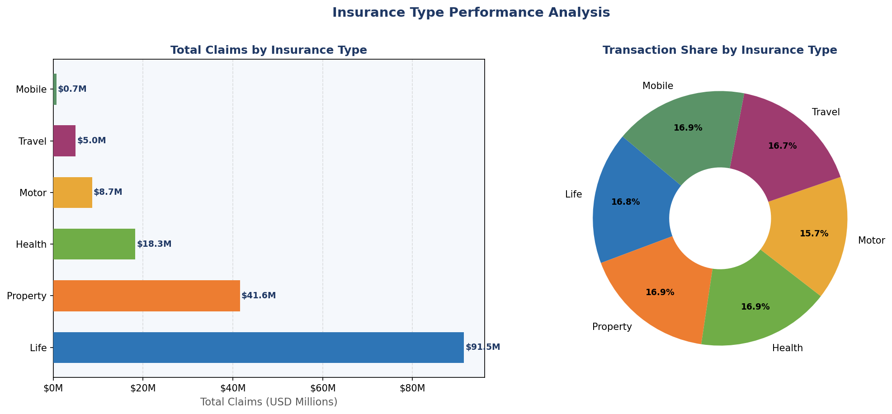
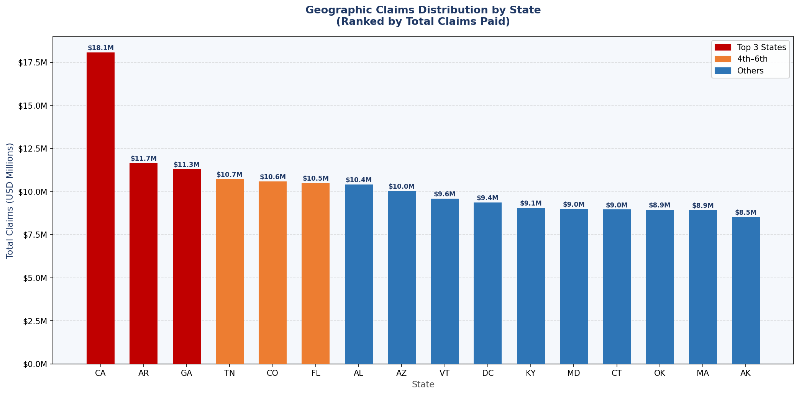
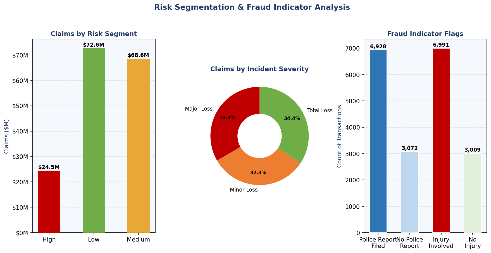
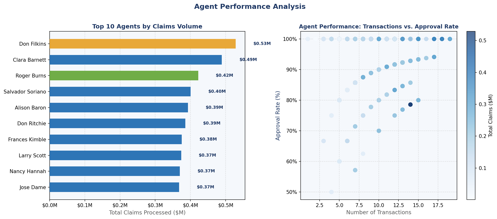
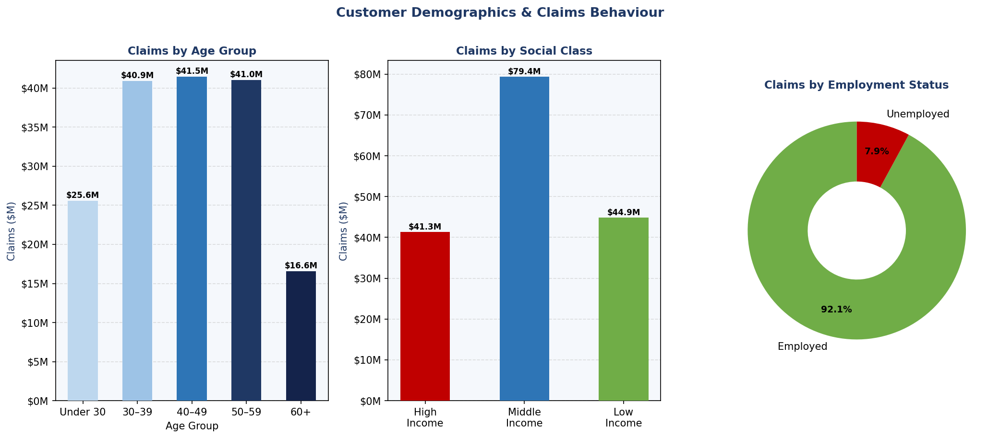

# Insurance Claims Analytics — Business Intelligence Project

**Tools Used:** Microsoft Excel · Microsoft Power BI  
**Data Period:** June 2020 – June 2021  
**Dataset Size:** 10,000 transactions · 1,200 agents · 600 vendors

---

## Project Overview

This project is a full end-to-end business intelligence analysis of an insurance company's claims and policy data. It covers everything from raw data cleaning and structuring to visual dashboards, giving a complete picture of claim trends, risk behavior, agent performance, and customer demographics.

The goal was to answer real business questions like:

- Which insurance product lines are driving the most claims?
- Are high-risk customers actually filing more claims?
- Which states have the highest claims exposure?
- Are there fraud patterns hiding in the data?
- Which agents are handling the largest volume of claims?

---

## Data Sources

Three internal data tables were used and joined for this analysis:

| File | Records | Description |
|---|---|---|
| `employee_data.xlsx` | 1,200 | Agent/employee master with joining dates and routing info |
| `insurance_data.xlsx` | 10,000 | Policy transactions with premiums, claim amounts, risk flags |
| `vendor_data.xlsx` | 600 | Vendor/third-party master data |

The insurance transactions table acts as the fact table. Employee and vendor data are dimension tables joined via `AGENT_ID` and `VENDOR_ID` respectively.

---

## Key Findings

**Claims Volume**
- Total claims paid across the period: **$165.6 Million**
- Total premiums collected: **$885,086** — resulting in an extremely high industry loss ratio, signaling underpricing risk
- Overall claim approval rate: **94.97%** (only 503 of 10,000 claims denied)

**By Insurance Type**
- Life insurance accounts for the single largest claim payout at **$91.5M (55.2%)**, driven by high per-claim amounts
- Property insurance is second at **$41.6M**, followed by Health at **$18.3M**
- Mobile insurance has the lowest total exposure at **$688K**

**Geographic Exposure**
- **California, Arkansas, and Georgia** are the top three states by total claims, together making up roughly 25% of all payouts
- 16 states are represented in the data with fairly distributed transaction volumes

**Risk & Fraud Signals**
- **69.3%** of all claims have a police report on file — a notably high figure that may indicate reporting culture or systemic fraud
- **69.9%** of claims involve bodily injury
- High, Medium, and Low risk segments are surprisingly close in total claim amounts (H: $24.5M, M: $68.6M, L: $72.6M), suggesting the risk model may need recalibration
- Total Loss, Major Loss, and Minor Loss incidents are almost evenly split — no single severity type dominates

**Agent Performance**
- Average of ~8 transactions per agent across the 1,200-person network
- Top-performing agents (by claims volume) process significantly more claims with approval rates near the overall average, suggesting consistent process adherence
- Approval rate distribution is narrow, with most agents clustering between 93–97%

**Customer Demographics**
- The 40–49 and 50–59 age brackets generate the highest claim volumes
- Middle Income and Low Income customers account for the majority of claims despite High Income customers having higher average claim amounts per transaction
- Employment status does not show a dramatically different claim pattern between employed and unemployed customers

---

## Excel Workbook Structure

The analyzed Excel file (`Insurance_Claims_Analytics.xlsx`) contains 10 sheets:

| Sheet | Contents |
|---|---|
| 📊 Dashboard | KPI summary cards + quick-view tables for type, risk, and monthly snapshot |
| Employee Data | Full agent master (1,200 records) with formatting |
| Insurance Transactions | Sample 500 transactions with all 38 fields |
| Vendor Data | All 600 vendors |
| Monthly Trend | Month-by-month claims vs. premiums with embedded line chart |
| By Insurance Type | Product line breakdown with bar chart |
| State Analysis | Geographic claims ranked by state with color-tiered formatting |
| Risk & Fraud Indicators | Risk segment table, severity breakdown, authority contacted, key findings box |
| Agent Performance | Top 20 agents ranked + overall network statistics |
| Customer Demographics | Age group, social class, employment, marital status breakdowns |
| Data Dictionary | Field-level definitions for all variables in the dataset |

---

## Power BI Dashboard

The Power BI file connects directly to the analyzed Excel workbook and contains five report pages:

1. **Executive Summary** — High-level KPI tiles, slicers for insurance type and date range
2. **Claims Trend** — Monthly line chart, YoY comparison if data extended
3. **Product & Geography** — Insurance type donut + state map visual
4. **Risk & Fraud** — Risk segment matrix, severity gauge, fraud flag tables
5. **Agent Scorecard** — Agent ranking table, approval rate sparklines

For setup instructions, see [`docs/PowerBI_Build_Guide.md`](docs/PowerBI_Build_Guide.md).

---

## Screenshots

### KPI Dashboard Overview

### Monthly Claims Trend

### Claims by Insurance Type

### State-Wise Geographic Analysis

### Risk Segmentation & Fraud Indicators

### Agent Performance

### Customer Demographics

---

## How to Use

1. Clone or download the repository
2. Open `data/` folder and review the three raw source files
3. Open `analysis/Insurance_Claims_Analytics.xlsx` for the full annotated analysis
4. Open `powerbi/Insurance_Dashboard.pbix` in Power BI Desktop (free download from Microsoft)
   - When prompted, update the data source path to point to your local `analysis/` folder
5. Refer to `docs/PowerBI_Build_Guide.md` if you want to rebuild the dashboard from scratch

---

## Tools & Skills Demonstrated

- **Data cleaning** — handling blanks, standardizing codes (A/D, H/M/L, Y/N), date formatting
- **Data joining** — VLOOKUP-equivalent merges across three tables using shared keys
- **Pivot-style aggregation** — grouping by type, state, risk, agent, month
- **Conditional formatting** — color scales, data bars, traffic light rules
- **Chart creation** — bar, line, pie/donut charts embedded in Excel sheets
- **Power BI modeling** — star schema data model, DAX measures, interactive slicers
- **Business storytelling** — findings framed in business language, not just numbers

---

*Analysis conducted on internal company data. All customer and employee identifiers are masked.*
